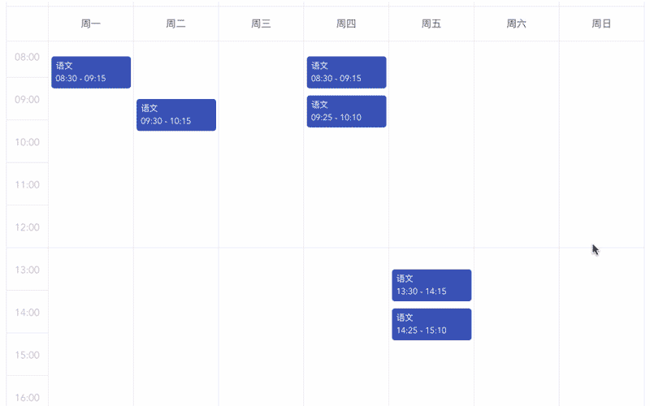

# scheduling-table



```bash
npm i -S @lanserdi/scheduling-table
```

```vue
<SchedulingTable
  @add="add"
  @remove="remove"
  @edit="showEditCourseModal"
  :initialCourses="courses"
></SchedulingTable>
```

```js
import SchedulingTable from "@lanserdi/scheduling-table";
export default {
  components: {
    SchedulingTable
  },
  data(){
    return {
      courses: [
        {
          name: "早读",
          day: 3,
          start: [6, 0],
          end: [6, 45],
        }
      ]
    }
  }
}
```